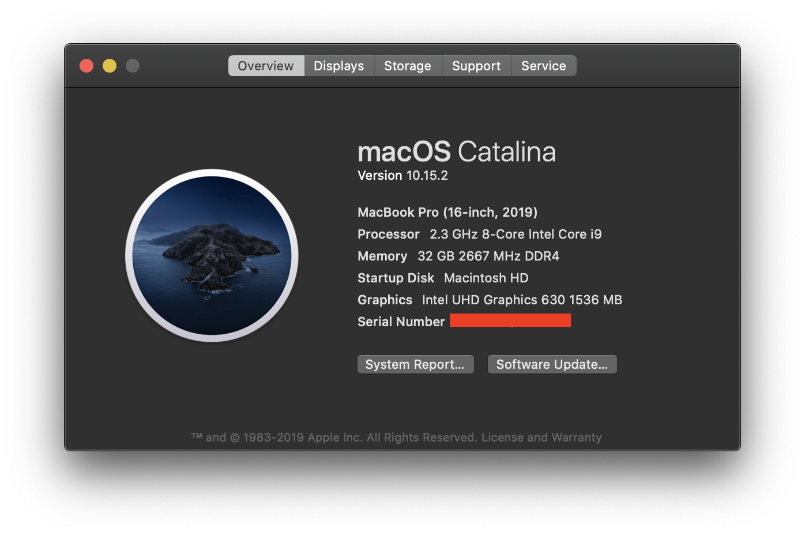
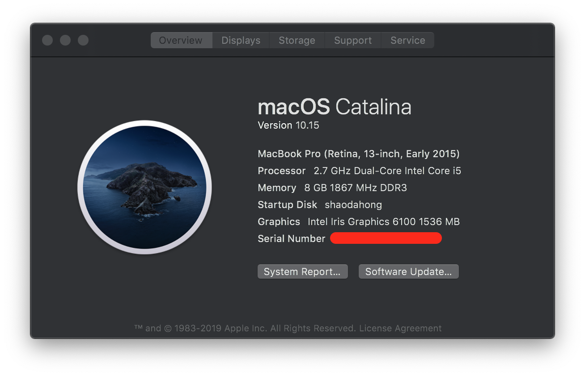

# Tools

平时用到的一些工具

## Mac 软件

主力生产工具 Macbook Pro

2019/12/31 更新

### 开发

#### 编辑器 [VSCode](https://github.com/microsoft/vscode)

- 主题 [Bear Theme](https://github.com/shaodahong/theme-bear), 自己根据默认的主题改的
- 插件
  - [Debugger for Chrome](https://marketplace.visualstudio.com/items?itemName=msjsdiag.debugger-for-chrome)，调试 Web 必备
  - [Document This](https://marketplace.visualstudio.com/items?itemName=joelday.docthis) 快捷生成 JSDoc 注释
  - [EditorConfig for VS Code](https://marketplace.visualstudio.com/items?itemName=EditorConfig.EditorConfig) 保持统一的编码风格
  - [ESLint](https://marketplace.visualstudio.com/items?itemName=dbaeumer.vscode-eslint) ESLint 插件
  - [GitHub Pull Requests](https://marketplace.visualstudio.com/items?itemName=GitHub.vscode-pull-request-github) PR 专用, 可以快速的 Checkout 和 Reply
  - [GitLens](https://marketplace.visualstudio.com/items?itemName=eamodio.gitlens) Git 增强
  - [Go](https://marketplace.visualstudio.com/items?itemName=ms-vscode.Go) 写 Go 必备
  - [Prettier](https://marketplace.visualstudio.com/items?itemName=esbenp.prettier-vscode) 格式化插件
  - [Settings Sync](https://marketplace.visualstudio.com/items?itemName=Shan.code-settings-sync) 同步和备份 VSCode 配置
  - [Path Intellisense](https://marketplace.visualstudio.com/items?itemName=christian-kohler.path-intellisense) 文件名自动完成插件
  - [npm Intellisense](https://marketplace.visualstudio.com/items?itemName=christian-kohler.npm-intellisense) npm 包自动完成插件

#### [Homebrew](https://brew.sh/)

- bat 替代 cat
- exa 替代 ls
- fd 替代 find
- go 用 brew 管理 Go
- httpie 调试接口用的
- mysql 数据库
- neovim 替代 vim
- tree 显示树形目录结构
- wifi-password 查看 Wi-Fi 密码
- yarn 用 brew 管理 yarn
- you-get 和 youtube-dl 解析视频用的
- z 快速跳转目录

Cask

- font-fira-code 编程字体
- kap 屏幕录制 GIF
- keycastr 显示按键
- iina 视频和音乐播放器
- karabiner-elements 改建
- switchhosts 快捷切换 hosts

#### [Oh My Zsh](https://ohmyz.sh/)

Mac OS X Catalina 默认也是 zsh，搭配这个使用可以快速配置

#### [Alfred 4](https://www.alfredapp.com/)

Workflows

- caniuse 查看兼容性
- colors 可以转颜色，很实用
- Encode/Decode 编解码用
- GitHub 快速跳转到仓库
- Google Translate 谷歌翻译
- IP Address 查看本机 IP 信息
- Package Managers 支持多种包信息搜索

#### Photoshop

查看设计资源，切图用

#### AppCleaner

卸载软件用的

#### BaiduNetdisk_mac

百度官方网盘客户端

#### Bartender 3

管理 menubar 图标

#### Cornerstone

管理 SVN

#### Downie 3

视频下载

#### Elpass

密码管理，Surge 3 作者新作品

#### Intel Power Gadget

查看电脑功耗和频率

#### IntelliJ IDEA

IDE，重构和写 Go 会用到

#### iTerm

替代默认的 terminal

#### Logi Options

罗技鼠标管理软件，用的 Master 2s

#### Motrix

下载工具，没有想象中的好用

#### NeteaseMusic

网易云音乐

#### Notion

笔记软件，提供丰富的模版

#### One Switch

实用的一些小工具

#### Postman

调试接口软件

#### PxCook

设计资源软件（公司实用）

#### QQ

#### Reeder

RSS 客户端，每天看新闻的来源

#### Sequel Pro

Mysql 客户端

#### ShadowsocksX-NG

小飞机

#### Sketch

切图用，也会设计一点小的图标

#### Surge 3

功能实用的小飞机

#### The Unarchiver

替换系统默认的解压软件

#### Tower

Git 管理软件

#### Twitter

官方出品，BUG 多多

#### VirtualBox

虚拟机管理软件，有时候还是需要用到 win 的

#### WeChat

微信

#### WeChat Work

企业微信

## Windos 软件

家里的台式机，第二生产力（性能完爆 Mac）

参数:

1. SSD-三星 960 EVO M.2 NVMe 250G
2. 内存-Corsair Vengeance LPX 16GB (2x8GB) DDR4 DRAM 3200MHz C16
3. CPU-i7-8700k
4. 机箱-NCASE M1
5. 主板-华硕 Z370-i gaming
6. 散热器-猫头鹰 D9L
7. 电源-海盗船 SF600
8. 显卡-迪兰（Dataland）RX VEGA 56 8GB HBM2 1156-1471/1600MHz 8G/2048-bit HBM2
9. 风扇-猫头鹰 A9
